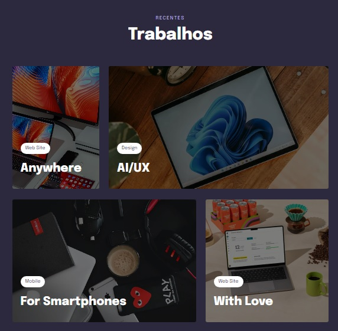

<h1 align="center"> Componente Trabalho </h1>

Projeto avançado do explorer 10, construimos uma página usando grid  
<a href="https://www.rocketseat.com.br/explorer">Connheça o Explorer.</a>

  <a href="#-tecnologias">Tecnologias</a>&nbsp;&nbsp;&nbsp;|&nbsp;&nbsp;&nbsp;
  <a href="#-projeto">Projeto</a>&nbsp;&nbsp;&nbsp;|&nbsp;&nbsp;&nbsp;
  <a href="#-layout">Layout</a>&nbsp;&nbsp;&nbsp;|&nbsp;&nbsp;&nbsp;
  <a href="#memo-licença">Licença</a>

  

 

  

## 🚀 Tecnologias

Esse projeto foi desenvolvido com as seguintes tecnologias:

- HTML
- CSS
- Git e Github
- Figma

## 💻 Projeto
Criamos uma página web com o título Trabalhos, onde adicionamos algumas imagens e ajustamos grid para ajusta cada imagen de acordo com o layout proposto.
Deixamos a página totalmente responsiva usando o media query.

- [Acesse o projeto finalizado, online](https://erlanmarinho.github.io/explorerDesafioForm2/)

## :memo: Licença

Esse projeto está sob a licença MIT.

---

Feito com ♥ by Rocketseat :wave: [Participe da nossa comunidade!](https://discord.gg/rocketseat)
